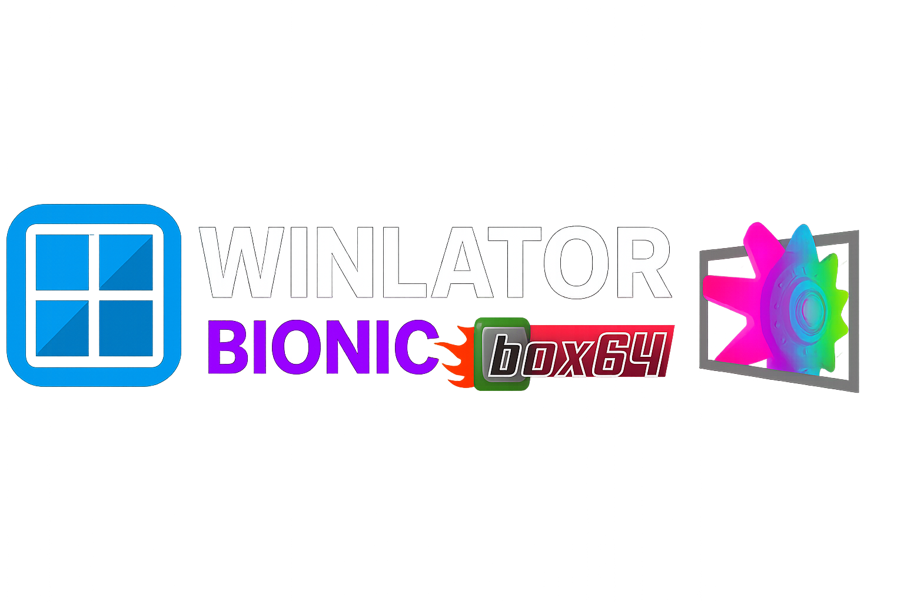

  

    

## WinNative: A Community Built Windows Emulation App for Android

**WinNative** is an advanced, high-performance Windows (x86_64) emulation environment for Android,
unifying the best of **Winlator Bionic** and **Pluvia**. It delivers the full Winlator experience,
makes it easy to connect your Steam, Epic and GOG libraries, and runs classic console games
alongside them.

| | |
| --- | --- |
| 📦 **Install** | [Releases](https://github.com/WinNative-Emu/WinNative/releases) |
| 🎮 **Retro consoles** | [docs/RETRO-CONSOLES.md](docs/RETRO-CONSOLES.md) — NES through PlayStation 2 |
| 🎞️ **Frame generation** | [docs/FRAME-GENERATION.md](docs/FRAME-GENERATION.md) — LSFG and DIS |
| 🔨 **Build from source** | [docs/BUILDING.md](docs/BUILDING.md) |
| 🙏 **Credits & licenses** | [CREDITS.md](CREDITS.md) · [EMULATOR_CREDITS.md](EMULATOR_CREDITS.md) |
| 💬 **Chat** | [Discord](https://discord.gg/uhTkvGfakU) |

---

### Installation

Grab the latest APK from [Releases](https://github.com/WinNative-Emu/WinNative/releases), launch
the app, allow the ImageFS to install, then add games manually or sync your library.

All four variants are the same app with a different package name:

| Variant | What it's for |
| --- | --- |
| `Vanilla` | Standard package name, for side-loading with other forks |
| `Ludashi` | Forces max GPU **and** CPU clocks on some devices (performance-mode trigger) |
| `Antutu` | Forces max GPU clocks on most devices (benchmark spoof) |
| `Pubg` | PUBG package name, which unlocks some Game Booster advanced features |

---

### Contributing

We welcome community contributions! Feel free to open a pull request for bug fixes, driver
updates, UI improvements, or anything else you'd like to add.

Please match the existing code style and ensure any AI-assisted code is thoroughly reviewed and
tested before submission.

---

### Credits

WinNative stands on work by **brunodev85** (Winlator), **Pipetto-crypto** (Winlator Bionic), the
**Pluvia**/**GameNative** community, the **Mesa3D** team, **Mr. Goldberg** and **Detanup01**
(Goldberg Steam Emulator), **Filippo Scognamiglio** (LibretroDroid) and the **libretro** core
authors, the **ARMSX2**, **PCSX2** and **Dolphin** teams, **PancakeTAS** (lsfg-vk),
**Camille LaVey** of the **Eden Emulator Project** (the Vulkan LSFG port this one derives from),
**qwertypower** of **DEVAR Entertainment LLC** (the open-source DIS engine), **OpenCV** and
Till Kroeger (the DIS algorithm), **DXVK** (the `dxbc` translator), and **The412Banner**
(DirectAudio, and with it microphone support).

That list is a summary, not the attribution itself. **[CREDITS.md](CREDITS.md)** carries the full
acknowledgments, including exactly which files came from which upstream project, and
**[EMULATOR_CREDITS.md](EMULATOR_CREDITS.md)** carries the per-component license table and the
GPL corresponding-source statement.

WinNative is released under the **GNU General Public License v3.0** — see [LICENSE](LICENSE).
